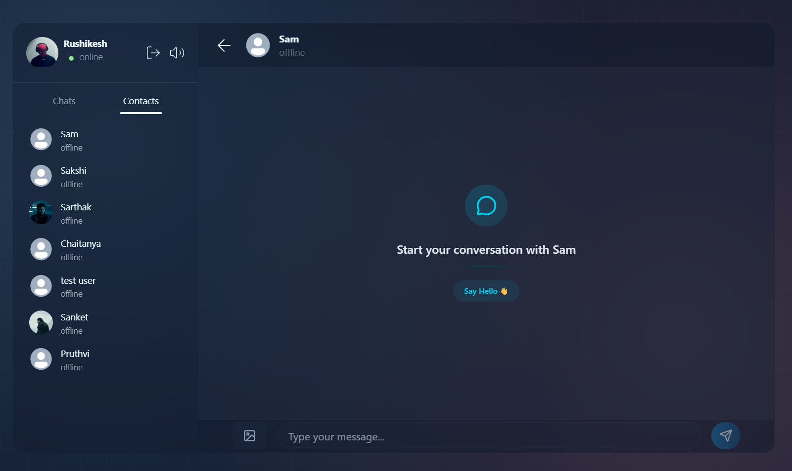
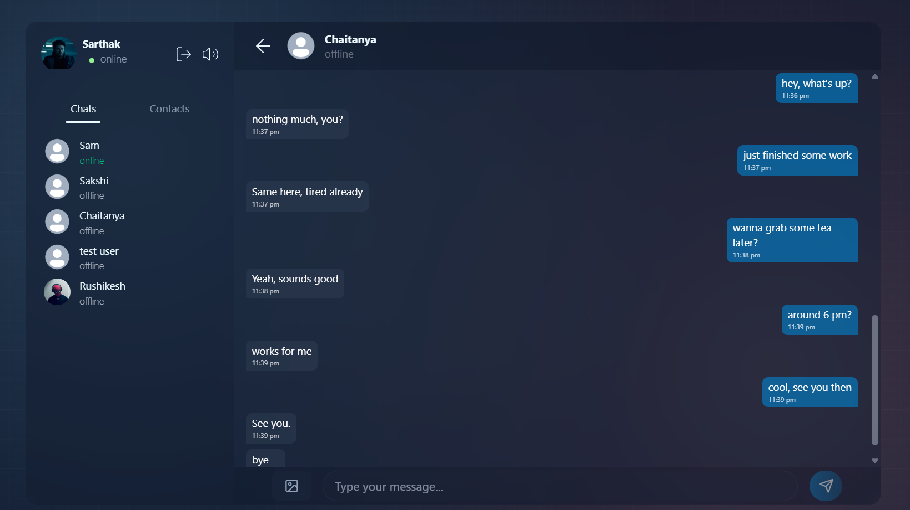
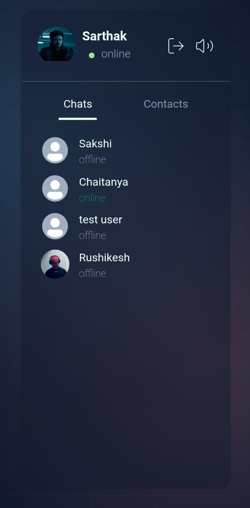

# Echo

Echo is a real-time communication platform designed for instant messaging. Built with a focus on speed and reliability, it uses modern web technologies to ensure messages are delivered instantly across users.

## Features

- **Real-Time Messaging:** Instant message delivery using WebSockets (Socket.io).
- **User Authentication:** Secure registration and login  with JWT.
- **Profile Management:** Users can update their account details and avatars.
- **Media Support:** User can send and receive images.
- **Online Status:** Real-time tracking of user status.
- **Responsive Design:** Design supports desktops, tablets and mobiles.
- **Message Persistence:** All conversations are securely stored and retrieved from MongoDB.

## Tech Stack

- **Backend**: Node.js, Express
- **Frontend**: React, zustand, axios
- **Style**: Tailwind CSS, daisyui, lucide-react
- **Real-time connection**: Socket.io
- **Authentication**: JWT, bycrypt
- **Database**: MongoDB, mongoose ODM
- **Media Management**: Cloudinary

## Screenshots
### Desktop

### Mobile

  
  
  

